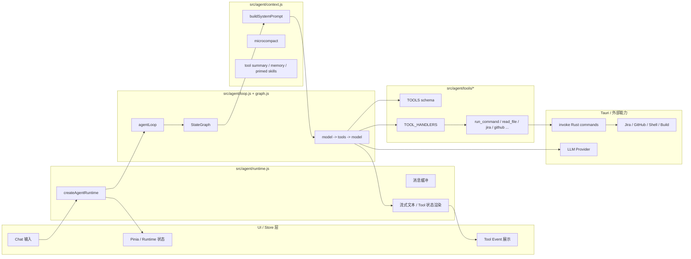
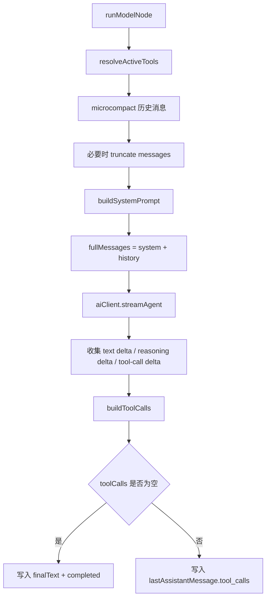
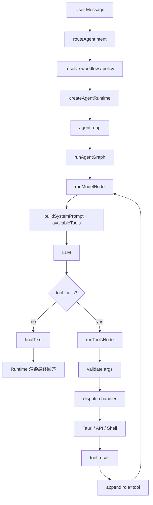

# FlowDesk Agent 执行链路图

> 日期：2026-04-14
> 范围：`src/agent/*`
> 目的：说明当前 Agent 从用户输入到模型推理、工具分发、结果回流、UI 展示的完整执行链路

---

## 1. 结论先看

当前 `src/agent` 是一套 **Agent 编排运行时（agent runtime / orchestration layer）**，核心职责不是直接执行 LLM 生成的 JS 代码，而是：

1. 接收用户消息与当前会话状态
2. 组装 system prompt、memory、skill、tool surface
3. 把 `messages + tools` 发给模型
4. 让模型自主决定是否调用 tool
5. 分发执行本地注册的 tool handler
6. 把 tool result 追加回消息历史
7. 继续下一轮模型推理，直到产出最终回答
8. 将中间事件与最终结果渲染到 UI

---

## 2. 总览执行链路图

```mermaid
flowchart TD
    A[用户在 UI 输入消息] --> B[createAgentRuntime.run]
    B --> C[准备 chatMessages / trace / AbortController]
    C --> D[agentLoop]
    D --> E[runAgentGraph]
    E --> F[runModelNode]
    F --> G[buildSystemPrompt + 组装 fullMessages]
    G --> H[aiClient.streamAgent messages + tools]
    H --> I{模型是否返回 tool_calls?}
    I -- 否 --> J[生成 finalText]
    J --> K[onText / UI 展示最终回答]
    I -- 是 --> L[runToolsNode]
    L --> M[校验 tool name / args]
    M --> N[按 toolName 找 handler]
    N --> O[执行 TOOL_HANDLERS[toolName]]
    O --> P[写入 role=tool 的结果消息]
    P --> Q{是否连续失败/终止?}
    Q -- 否 --> F
    Q -- 是 --> R[停止自动重试 / 输出错误]
    R --> K
```

---

## 3. 分层视角



---

## 4. 关键时序图

```mermaid
sequenceDiagram
    participant User as 用户
    participant UI as Runtime/UI
    participant Loop as agentLoop
    participant Graph as runAgentGraph
    participant Model as LLM
    participant Tools as Tool Handlers
    participant Infra as Tauri/Rust/外部系统

    User->>UI: 输入问题
    UI->>Loop: agentLoop(messages, options)
    Loop->>Graph: runAgentGraph(...)
    Graph->>Graph: runModelNode()
    Graph->>Model: streamAgent(fullMessages, tools)
    Model-->>Graph: assistant delta / tool_call delta

    alt 模型直接回答
        Graph-->>Loop: finalText
        Loop-->>UI: onText(finalText)
        UI-->>User: 展示最终回答
    else 模型决定调用工具
        Graph->>Tools: handler(args, ctx)
        Tools->>Infra: invoke(...) / shell / API
        Infra-->>Tools: result
        Tools-->>Graph: tool result JSON
        Graph->>Graph: append role=tool message
        Graph->>Model: 下一轮 messages + tool result
        Model-->>Graph: 新一轮回答或 tool_calls
    end
```

---

## 5. 真实代码链路映射

### 5.1 入口：`src/agent/runtime.js`

`createAgentRuntime()` 是 UI 与 Agent 之间的桥梁，负责：

- 维护 `chatMessages`、`agentMessages`、`agentRunning`
- 创建/清理 `AbortController`
- 接收 `onToolStart` / `onToolEnd` / `onEvent`
- 把 tool 事件渲染成“正在执行 / 执行完成 / 自动恢复中”
- 把最终文本以流式方式推回聊天界面

可以理解为：**runtime 负责会话生命周期与展示，不负责决策本身。**

### 5.2 主循环：`src/agent/loop.js`

`agentLoop()` 负责启动一次完整 Agent 运行：

- 读取 AI 配置
- 调用 `runAgentGraph()`
- 监听 graph 事件
- 在 tool start / tool end 时回调 UI
- 在图执行完成后写回最终消息历史

这里的关键原则已经直接写在代码注释中：

- **The LLM decides which tool to call**
- **The loop just dispatches**

也就是说，`loop` 是编排器，不是写死流程的业务控制器。

### 5.3 状态图：`src/agent/graph.js`

当前 Agent 用 `@langchain/langgraph` 定义了一个最小状态图：

- `model` 节点：向 LLM 发起一轮请求
- `tools` 节点：执行模型刚刚请求的 tool calls
- 路由规则：
  - 没有 tool call -> 结束
  - 有 tool call -> 进入 tools 节点
  - tools 执行完 -> 再回到 model

本质上仍然是经典的：

`model -> tools -> model -> tools -> ... -> final answer`

---

## 6. model 节点内部链路



### 这里做了什么

1. 根据 workflow 决定暴露哪些 tools
2. 对旧的 tool result 做 `microcompact`
3. 组装 system prompt：
   - role intro
   - tool summary
   - skills 可用列表
   - policy
   - memory
   - primed skills
   - 当前状态
4. 调用 `aiClient.streamAgent({ messages, tools })`
5. 把流式返回拼成：
   - 文本回答
   - reasoning 内容
   - tool calls

---

## 7. tools 节点内部链路

```mermaid
flowchart TD
    A[runToolsNode] --> B[读取 lastAssistantMessage.tool_calls]
    B --> C[逐个处理 tool call]
    C --> D[validateToolCall]
    D --> E{参数是否合法?}
    E -- 否 --> F[buildRecoverableValidationResult]
    E -- 是 --> G[resolve handler]
    G --> H{handler 存在?}
    H -- 否 --> I[Unknown tool error]
    H -- 是 --> J[await handler(args, ctx)]
    J --> K[生成 toolStatus]
    K --> L[追加 role=tool 消息]
    L --> M[trackToolFailure]
    M --> N{是否应停止?}
    N -- 否 --> O[继续下一 tool / 返回 model]
    N -- 是 --> P[输出连续失败终止文案]
```

### 这里的关键点

- tool 参数校验失败时，不一定立刻 hard fail
- 当前实现支持 **recoverable validation error**
- 即：告诉模型“参数缺失了，你自己补齐后重试”
- 这使得 Agent 有一定的 **self-healing** 能力

---

## 8. Tool Surface 是如何决定的

当前不是所有场景都暴露同一组工具，而是按 workflow 收缩工具面。

### 通用模式 `general`

来自 `src/agent/workflows/index.js`：

- mode: `general`
- toolTags: `['base']`

即默认只暴露基础工具，例如：

- `run_command`
- `read_file`
- `list_directory`
- `scan_workspace_repos`
- `load_skill`

### 发布模式 `release`

- mode: `release`
- toolTags: `['base', 'release']`

除基础工具外，还会暴露：

- `check_credentials`
- `fetch_jira_versions`
- `fetch_version_issues`
- `scan_pr_status`
- `run_preflight`
- `run_build`

这意味着：

- **LLM 可以动态选 tool**
- 但只能在“当前 workflow 允许的工具子集”里选
- 所以这是 **受约束的动态决策**，而不是无限制自治

---

## 9. 当前是否能动态执行代码

### 可以动态决定执行哪个工具

是，当前架构已经支持：

- LLM 根据 prompt + 历史消息 + tool schema
- 动态返回 `tool_calls`
- runtime 再把它分发给对应 handler

### 不能直接执行 LLM 生成的 JS/TS 代码

当前源码中没有看到：

- `eval`
- `new Function`
- `vm`

所以它不是“模型生成一段 JS 然后直接在前端运行”。

### 但可以间接执行命令

`run_command` tool 会调用 Tauri `invoke('agent_run_command', ...)`，所以当前支持的是：

- **LLM -> 选择 `run_command` -> 执行 shell 命令**

这属于“动态执行命令”，不是“动态解释执行 JS 代码”。

---

## 10. 当前与 MCP 的关系

当前实现是 **本地 Tool Registry 架构**，不是标准 MCP 调用链，但两者很接近。

### 当前形态

- `TOOLS`：给模型看的 schema 数组
- `TOOL_HANDLERS`：本地 dispatch map
- handler 内部再去调用：
  - Tauri command
  - shell
  - Jira API
  - GitHub API

### 如果升级成 MCP-aware 架构

可以把某些 handler 改造成 MCP Client Adapter：

```text
LLM -> tool_calls -> local dispatcher -> MCP client -> MCP server -> result -> role=tool -> LLM
```

也就是说，**当前的 agent loop / graph 几乎不用重写，只需要扩展 tool handler 的实现方式即可。**

---

## 11. 一页版执行链路摘要



---

## 12. 推荐你后续继续看的文件

如果后面还要继续改 Agent，优先看这几个文件：

1. `src/agent/runtime.js`：会话生命周期、UI 事件渲染
2. `src/agent/loop.js`：Agent 总入口
3. `src/agent/graph.js`：真正的 model/tools 主循环
4. `src/agent/context.js`：system prompt 组装、context 压缩
5. `src/agent/tools/index.js`：工具注册表
6. `src/agent/workflows/index.js`：workflow 到 tool subset 的映射
7. `src/agent/router.js`：用户意图如何路由到 general / release

---

## 13. 最后一句话

当前 FlowDesk Agent 的核心范式可以概括为：

> **UI 管会话，Graph 管循环，LLM 做决策，Tools 做执行，结果再回流给 LLM。**

这也是它为什么已经具备 Agent 雏形、并且很容易继续演进到 MCP / 更复杂工作流架构的原因。
