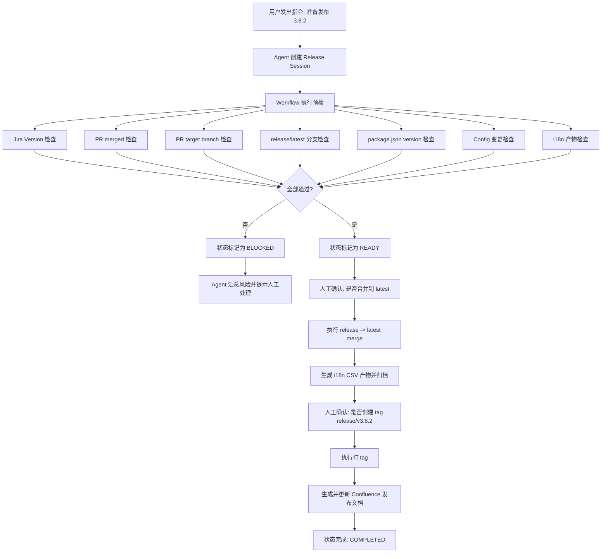
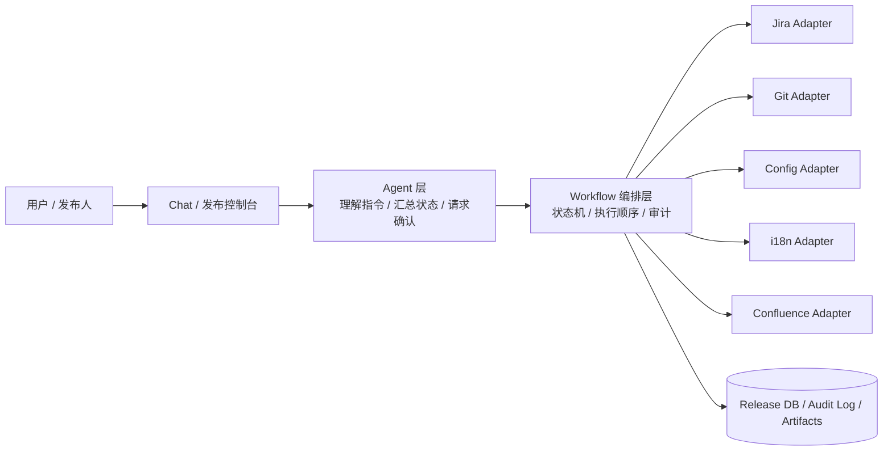

# 发布 Agent 方案 B 文档摘要

> 版本：2026-04-07  
> 方案定位：工作流引擎 + Chat 入口  
> 适用范围：多 Git 仓库前端系统（React / Vue），围绕 `release/x.y.z`、`latest`、Jira Version、PR、配置文件、i18n、Confluence 的发布场景。

---

## 1. 背景与问题定义

当前发布流程存在以下典型问题：

1. **发布信息分散**：Jira、Git 仓库、PR、配置文件、i18n 脚本、Confluence 分散在多个系统中。
2. **人工协作链路长**：发布人需要反复和开发负责人确认版本、配置、PR 状态、i18n 产物等信息。
3. **规则隐性化**：很多发布规则存在于人的经验里，没有形成可执行的系统规则。
4. **高风险动作缺乏审计**：例如手动改 `public/*.json`、手动打 tag、手动补 Confluence 文档，容易出错且难回溯。
5. **缺少统一发布状态**：没有一个统一的“版本发布会话”来表示当前版本发布到了哪一步、卡在哪一步、谁确认过什么。

因此，本项目的目标不是单纯做一个聊天机器人，而是建设一套**发布操作系统**：

- Agent 负责理解指令、解释状态、协助确认；
- Workflow 负责执行规则、运行检查、落审计；
- 人工只在关键节点做确认和最终决策。

---

## 2. 方案选择结论

### 候选方案

#### 方案 A：纯聊天 Agent 直连所有系统
- 优点：看起来最智能。
- 缺点：风险高、行为不稳定、审计弱、难以做强约束。

#### 方案 B：**工作流引擎 + Chat 入口**（推荐）
- Agent 负责：自然语言理解、状态解释、风险提示、确认收集。
- 工具链 / 工作流负责：检查、合并、打 tag、生成产物、更新文档。
- 特点：稳定、可审计、可扩展、便于分阶段建设。

#### 方案 C：仅做发布后台，不做 Agent
- 优点：最稳。
- 缺点：交互效率和智能化不足。

### 最终建议

采用 **方案 B**，但分阶段落地时，**前两期先偏向方案 C**：

1. 先做“发布检查中心 / 控制台”；
2. 再接入自动化执行能力；
3. 最后补上聊天式 Agent 入口。

这样既能快速落地，又能控制风险。

---

## 3. 设计原则

### 3.1 Agent 不直接决定是否发版
所有是否可以继续的判断，都由**明确规则**决定，而不是由大模型“推断”。

### 3.2 高风险动作必须人工确认
至少以下动作必须确认：
- `release/x.y.z -> latest` 合并
- tag 创建
- 配置变更写入
- Confluence 正式发布文档提交

### 3.3 每次发布必须形成一个 Release Session
系统要围绕 `Release Session` 组织：
- 当前版本号
- 参与发布的仓库
- 所有检查项结果
- 所有人工确认记录
- 生成的产物（CSV、diff、文档链接等）
- 当前状态机流转

### 3.4 所有关键动作必须可追溯
至少记录：
- 谁触发了动作
- 什么时间触发
- 针对哪个版本 / 仓库
- 成功还是失败
- 对应 commit / tag / 附件 / diff 是什么

---

## 4. 总体架构

### 4.1 分层架构

1. **交互层**
   - 发布控制台（Web）
   - Chat 界面
   - 审批 / 确认弹窗

2. **Agent 层**
   - 解析自然语言指令
   - 汇总发布状态
   - 输出风险说明
   - 请求人工确认
   - 调用编排层工具

3. **编排层（Workflow）**
   - 建立 Release Session
   - 维护状态机
   - 运行检查任务
   - 协调 merge / tag / artifact / 文档更新

4. **适配层（Adapter）**
   - Jira Adapter
   - Git Adapter
   - Config Adapter
   - i18n Adapter
   - Confluence Adapter

5. **数据与审计层**
   - Release Session 数据
   - 检查结果
   - 审批记录
   - 执行日志
   - 产物元数据

---

## 5. 核心业务对象

建议最少包含以下对象：

- `ReleaseSession`
- `ReleaseRepo`
- `ReleaseIssue`
- `PullRequestCheck`
- `PackageVersionCheck`
- `ConfigChange`
- `I18nArtifact`
- `ApprovalRecord`
- `OpsDocument`

### 推荐状态流转

`draft -> checking -> blocked -> ready -> approved -> merged -> tagged -> documented -> completed`

只要任一关键检查失败，状态进入 `blocked`，不得继续自动化执行。

---

## 6. 发布前检查规则（Preflight Checks）

这是方案 B 的第一优先级能力。

### 6.1 Jira Version 检查
系统根据版本号（如 `3.8.2`）读取对应 Jira Version：
- 该版本下挂载了哪些 issue
- issue 是否都处于允许发布的状态
- issue 是否缺少 PR 关联
- issue 是否与目标仓库匹配

### 6.2 PR 状态检查
对每个 issue 关联的 PR 执行检查：
- PR 是否存在
- 是否已经 merged
- 是否归属正确仓库

### 6.3 PR Target Branch 检查
所有用于本次发版的 PR，base branch 应当指向：
- `release/v3.8.2`

若 PR 指向：
- `epic/*`
- `feat/*`
- 错误的 release 分支

则系统标记为风险并阻塞发布。

### 6.4 Release / Latest 分支存在性检查
每个参与发布的仓库需要至少具备：
- `release/v3.8.2`
- `latest`

### 6.5 **Package Version 检查**
这是本次新增规则，必须作为硬性校验。

对于参与发布的前端仓库，系统在 `release/v3.8.2` 分支上检查 `package.json`：

- 从分支名中提取版本号：`3.8.2`
- 校验 `package.json.version === "3.8.2"`

若不一致，则：
- 标记为 `BLOCKED`
- 阻止继续发布
- 输出实际值与期望值差异

这条规则用于保证：
- 构建产物版本一致
- 运维认知一致
- 线上问题排查时版本号可追溯

### 6.6 Config 变更检查
系统需要知道：
- 本版本是否包含配置变更
- 哪些仓库存在配置变更
- 配置变更是否已经结构化登记

避免继续依赖“开发口头通知 + 发布人手工修改 public 下 JSON”模式。

### 6.7 i18n 变更检查
系统在 release 合并 latest 前：
- 对比 `release/v3.8.2` 与 `latest`
- 找出新增 / 变更的 i18n key
- 校验各仓库是否具备 CSV 生成脚本
- 生成并归档 CSV 产物

---

## 7. 配置变更治理方案

当前配置变更是整个发布流程中最危险的环节之一。

### 当前问题
- 配置往往在 `public/*.json`
- 由开发负责人告知发布人手工改写
- 无法审计、无结构化记录、容易漏改

### 改造目标
引入 `ConfigChangeRequest` 概念，把配置变更标准化为：
- 仓库名
- 目标文件
- JSON Path
- 新值
- 变更说明
- 提供人
- 审批人
- 版本号

### 系统能力
系统负责：
- 校验目标路径合法性
- 生成 diff 预览
- 执行更新前请求确认
- 记录操作日志
- 将配置变更纳入发布会话

原则：**配置应被代码化、结构化、可审计化。**

---

## 8. i18n 自动化方案

在 `release -> latest` 合并前，自动执行以下链路：

1. 对比 `release/v3.8.2` 和 `latest`
2. 识别新增 / 修改 i18n key
3. 针对每个系统执行对应脚本生成 CSV
4. 将 CSV 保存为本次 release artifact
5. 在后续更新 Confluence 时自动挂载

收益：
- 避免手工跑漏
- 避免 CSV 与代码版本不一致
- 方便运维与翻译链路追溯

---

## 9. 合并、打 Tag 与发布文档

### 9.1 合并策略
当且仅当以下条件全部通过，状态才能进入 `ready`：
- Jira 检查通过
- PR merged 检查通过
- PR target branch 检查通过
- package version 检查通过
- config 变更已确认
- i18n 产物已生成或确认无需生成

然后由人工确认执行：
- 将 `release/v3.8.2` 合并到 `latest`

### 9.2 Tag 策略
在 latest 合并完成且校验成功后：
- 创建 tag：`release/v3.8.2`

系统记录：
- 仓库名
- tag 名称
- commit sha
- 操作人
- 时间戳

### 9.3 Confluence 文档自动生成
发布完成后，系统根据模板生成运维发布文档草稿，至少包含：
- 版本号
- 发布系统列表
- tag / commit 信息
- i18n CSV 附件
- 是否存在 config 变更
- 风险提示 / 发布说明

最终由人工确认后提交。

---

## 10. 推荐交互方式

### 10.1 Chat 指令示例
用户：
> 准备发布 3.8.2

Agent：
> 已建立 Release Session：3.8.2。  
> 我发现 6 个仓库参与本次发布。  
> 当前检查结果：2 个 PR 未 merged，1 个 PR target branch 错误，1 个仓库 package version 不一致。  
> 当前状态：BLOCKED。是否查看详情？

### 10.2 关键确认示例
用户：
> 开始合并到 latest

Agent：
> 当前所有检查已通过。  
> 请确认是否将以下仓库的 `release/v3.8.2` 合并到 `latest`。  
> [确认] [取消]

---

## 11. 分阶段实施路线

### Phase 1：只读发布检查器（MVP）
目标：先解决“当前是否可以发版”。

范围：
- Jira Version 检查
- PR merged 检查
- PR target branch 检查
- release/latest 分支存在性检查
- package version 检查
- readiness report 输出

### Phase 2：配置变更结构化
范围：
- ConfigChangeRequest 模型
- 配置 diff 预览
- 配置审批流
- 配置操作审计

### Phase 3：i18n 产物自动化
范围：
- 分支差异识别
- i18n key 变化收集
- CSV 自动生成与归档

### Phase 4：受控 merge / tag
范围：
- 自动化 merge
- 自动化打 tag
- 失败重试与审计日志

### Phase 5：Confluence 自动发布文档
范围：
- 模板填充
- 附件上传
- 发布说明落文档

### Phase 6：聊天式 Agent
范围：
- 自然语言入口
- 风险解释
- 节点确认
- 统一会话体验

---

## 12. 建议的最小可行版本（MVP）

推荐先做一个 **发布检查中心**，输入版本号 `3.8.2` 后自动输出：

- 参与发布的仓库列表
- Jira issue 完整性
- PR merged 状态
- PR target branch 合法性
- `package.json.version` 是否等于 `3.8.2`
- 是否存在未登记的 config 变更
- 是否允许进入发布阶段

这一步不直接修改代码，不直接操作线上分支，收益最大，风险最低。

---

## 13. 流程图（Mermaid）

---

## 14. 逻辑图（架构视图）

---

## 15. 最终结论

对于当前多仓库、多规则、多人工沟通的发布流程，最合适的方向不是“直接做一个全能 Agent”，而是：

> **先把发布流程拆成明确规则、标准对象和可执行工作流，再让 Agent 成为统一入口。**

因此，方案 B 的核心价值在于：
- 用 Workflow 保证稳定和审计；
- 用 Agent 降低操作门槛和沟通成本；
- 用人工确认守住关键风险点；
- 用 Release Session 把分散流程变成一条完整链路。

建议立即从 **Phase 1：只读发布检查器** 开始。

